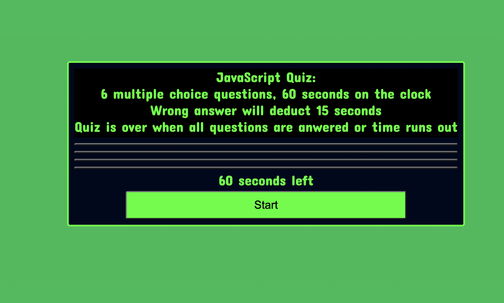

# JavaScript Code QUIZ

## Descrption:

The site is a simple multiple choice quiz, that using DOM manipulation, cycles through several multiple choice questions about 

JavaScript. Selecting an answer will display next question, if wrong answer is selected a time penalty is imposed. 

Quiz is over when time runs out or all questions are answered. Score will be based on remaining time, if user has time 

remaining then a prompt will ask for name and display top 5 scores. If no time is remaining then a prompt to start over will 

appear. 

[Link to Deployed site](https://ivanfelipeescobar.github.io/Code-Quiz/)

## Credits:

Created by Ivan Felipe Escobar